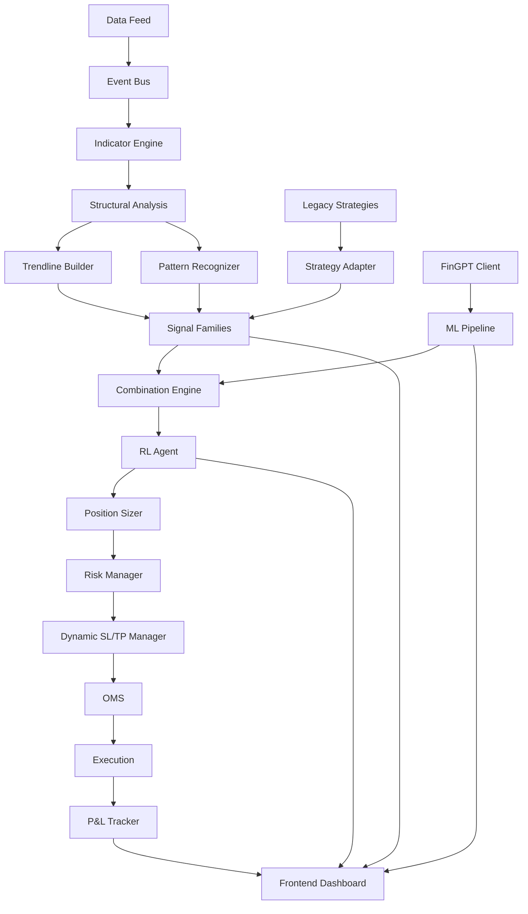
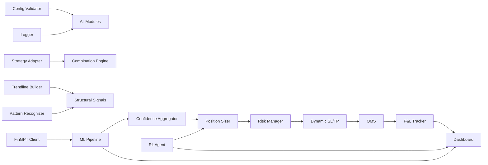

# Design Document: AlgoForge System Integration

## Overview

This design document specifies the integration architecture for transforming AlgoForge from a well-architected foundation into a fully operational trading system. The project addresses 20 major requirements across seven integration modules:

1. **Legacy Strategy Integration** - Connecting 31 existing strategies to the signal framework
2. **Structural Analysis Completion** - Integrating trendline detection and candlestick patterns
3. **AI/ML Enhancement** - Activating FinGPT, ML pipeline, and RL feedback loops
4. **Dynamic Position Management** - Implementing confidence-based sizing and dynamic SL/TP
5. **P&L Enhancement** - Adding percentage returns and R-multiple tracking
6. **Frontend Completion** - Building comprehensive dashboard with real-time monitoring
7. **System Hardening** - Adding configuration validation, logging, testing, performance optimization, and error handling

### Design Principles

1. **Preserve Existing Architecture** - Build on the proven event-driven, risk-first design
2. **Minimal Disruption** - Integrate new components without breaking existing functionality
3. **Graceful Degradation** - System continues operating when optional components fail
4. **Observable Integration** - Every integration point logs its activity for debugging
5. **Testable Components** - All new modules include comprehensive test coverage

### Success Criteria

- All 20 requirements implemented and validated
- 583 existing tests continue passing
- New integration tests achieve >80% coverage
- End-to-end flow validated from fundamental analysis through execution
- System processes 50+ instruments in <2 seconds per bar
- Dashboard displays all metrics with <1s latency

## Architecture

### High-Level System Flow



### Integration Layers

The system is organized into four integration layers:

**Layer 1: Data & Analysis**
- Existing: Data feeds, indicator engine, structural analysis
- New: Trendline builder integration, candlestick pattern recognizer

**Layer 2: Signal Generation**
- Existing: 5 signal families (momentum, mean reversion, breakout, structural, microstructure)
- New: Legacy strategy adapter, strategy registry, enhanced pairs trading

**Layer 3: Intelligence & Decision**
- Existing: Combination engine, HMM regime detector
- New: FinGPT client, ML pipeline activation, RL threshold adjuster, confidence aggregator

**Layer 4: Execution & Monitoring**
- Existing: Risk manager, OMS, paper trading engine
- New: Dynamic SL/TP manager, enhanced P&L tracker, comprehensive dashboard

### Module Dependencies



## Components and Interfaces

### 1. Strategy Adapter (Requirement 1)

**Purpose:** Convert legacy strategy outputs into standardized SignalResult format

**Interface:**
```python
class StrategyAdapter:
    """Adapts legacy strategies to the SignalResult interface."""
    
    def __init__(self, strategy: Strategy, family_name: str):
        """Initialize adapter with a strategy instance and its signal family."""
        self.strategy = strategy
        self.family_name = family_name
    
    async def generate_signal(
        self,
        symbol: str,
        snapshot: StructuralSnapshot,
        indicators: dict[str, float],
        regime_probs: dict[str, float]
    ) -> SignalResult:
        """Convert strategy output to SignalResult.
        
        Returns:
            SignalResult with score normalized to [-1, 1]
        """
        pass
```

**Key Responsibilities:**
- Call legacy strategy's `generate_signal()` method
- Normalize output score to [-1, 1] range
- Map strategy direction to SignalDirection enum
- Preserve strategy metadata (name, timeframe, confidence)
- Validate output bounds

**Integration Points:**
- Input: Legacy Strategy instance
- Output: StandardizedSignalResult
- Consumer: Combination Engine

### 2. Integration Registry (Requirement 1)

**Purpose:** Maintain mapping of legacy strategies to signal families

**Interface:**
```python
class IntegrationRegistry:
    """Registry mapping legacy strategies to signal families."""
    
    def register_strategy(
        self,
        strategy_class: type[Strategy],
        family_name: str,
        weight: float = 1.0
    ) -> None:
        """Register a strategy with its signal family."""
        pass
    
    def get_strategies_for_family(self, family_name: str) -> list[Strategy]:
        """Get all strategies registered to a signal family."""
        pass
    
    def get_all_adapters(self) -> list[StrategyAdapter]:
        """Get all strategy adapters for signal generation."""
        pass
```

**Registry Structure:**
```python
{
    "momentum": [
        (EMACrossover, 1.0),
        (DualMomentum, 1.0)
    ],
    "mean_reversion": [
        (MeanReversion, 1.0),
        (PairsTrading, 0.8)
    ],
    "breakout": [
        (BreakoutStrategy, 1.0),
        (LiquidityTrapStrategy, 0.7)
    ],
    "structural": [
        (TrendlinePullback, 1.2),
        (ReversalStrategy, 1.0),
        (EMABounce, 0.9)
    ]
}
```

### 3. Trendline Builder Integration (Requirement 2)

**Purpose:** Detect and track trendlines for structural analysis

**Interface:**
```python
class TrendlineBuilder:
    """Detects and maintains trendlines from price action."""
    
    def detect_trendlines(
        self,
        symbol: str,
        bars: pd.DataFrame,
        min_touches: int = 3
    ) -> list[Trendline]:
        """Detect valid trendlines from historical bars."""
        pass
    
    def update_trendlines(
        self,
        symbol: str,
        new_bar: Bar
    ) -> list[Trendline]:
        """Update existing trendlines with new bar data."""
        pass
    
    def check_proximity(
        self,
        price: float,
        trendline: Trendline,
        atr: float,
        threshold: float = 0.5
    ) -> bool:
        """Check if price is within threshold ATR of trendline."""
        pass
```

**Data Model:**
```python
class Trendline(BaseModel):
    """Represents a detected trendline."""
    
    id: str
    symbol: str
    slope: float
    intercept: float
    touches: list[datetime]
    strength: float  # 0-1 based on touches and angle
    direction: Literal["support", "resistance"]
    valid_from: datetime
    last_touch: datetime
    invalidated: bool = False
```

**Integration Points:**
- Called by: Orchestrator on every bar
- Stores to: StructuralSnapshot
- Consumed by: Structural Signal Family, Breakout Signal Family

### 4. Candlestick Pattern Recognizer (Requirement 3)

**Purpose:** Detect candlestick patterns for signal confirmation

**Interface:**
```python
class PatternRecognizer:
    """Recognizes candlestick patterns from price action."""
    
    def recognize_patterns(
        self,
        bars: pd.DataFrame,
        lookback: int = 5
    ) -> list[CandlestickPattern]:
        """Detect patterns in recent bars."""
        pass
    
    def classify_pattern(
        self,
        pattern: CandlestickPattern
    ) -> tuple[str, float]:
        """Classify pattern direction and strength.
        
        Returns:
            (direction, strength) where direction is 'bullish'/'bearish'
            and strength is 'weak'/'moderate'/'strong'
        """
        pass
```

**Supported Patterns:**
1. Engulfing (bullish/bearish)
2. Hammer / Shooting Star
3. Doji
4. Morning Star / Evening Star
5. Three White Soldiers / Three Black Crows
6. Harami
7. Piercing Line / Dark Cloud Cover
8. Hanging Man / Inverted Hammer
9. Marubozu
10. Spinning Top

**Data Model:**
```python
class CandlestickPattern(BaseModel):
    """Represents a detected candlestick pattern."""
    
    pattern_type: str
    direction: Literal["bullish", "bearish", "neutral"]
    strength: Literal["weak", "moderate", "strong"]
    bars_involved: int
    timestamp: datetime
    at_sr_level: bool = False
    confluence_boost: float = 0.0  # 0-0.3
```

### 5. FinGPT Client (Requirement 4)

**Purpose:** Generate AI-powered price predictions

**Interface:**
```python
class FinGPTClient:
    """Client for FinGPT price prediction API."""
    
    def __init__(self, api_key: str, cache_ttl: int = 300):
        """Initialize with API credentials and cache settings."""
        self.api_key = api_key
        self.cache = TTLCache(maxsize=1000, ttl=cache_ttl)
    
    async def predict_price(
        self,
        symbol: str,
        bars: pd.DataFrame,
        horizons: list[int] = [1, 5, 10]
    ) -> FinGPTPrediction:
        """Generate price predictions for multiple horizons.
        
        Returns:
            Predictions with confidence intervals
        """
        pass
    
    def get_cached_prediction(
        self,
        symbol: str,
        timestamp: datetime
    ) -> FinGPTPrediction | None:
        """Retrieve cached prediction if available."""
        pass
```

**Data Model:**
```python
class FinGPTPrediction(BaseModel):
    """FinGPT price prediction with confidence intervals."""
    
    symbol: str
    timestamp: datetime
    predictions: dict[int, PricePoint]  # horizon -> prediction
    confidence: float  # 0-1
    direction: Literal["up", "down", "neutral"]
    
class PricePoint(BaseModel):
    """Single price prediction point."""
    
    price: float
    lower_bound: float
    upper_bound: float
    confidence_interval_width: float
```

### 6. ML Pipeline Orchestrator (Requirement 5)

**Purpose:** Coordinate ML model predictions and ensemble

**Interface:**
```python
class MLPipelineOrchestrator:
    """Orchestrates ML model predictions and ensemble."""
    
    def __init__(self, config: MLConfig):
        self.xgboost_model = XGBoostClassifier()
        self.lstm_model = LSTMForecaster()
        self.ensemble_model = EnsembleMetaModel()
        self.feature_engineer = FeatureEngineer()
    
    async def generate_prediction(
        self,
        symbol: str,
        bars: pd.DataFrame,
        indicators: dict[str, float],
        fingpt_pred: FinGPTPrediction | None
    ) -> MLPrediction:
        """Generate ensemble ML prediction."""
        pass
    
    def compute_features(
        self,
        bars: pd.DataFrame,
        indicators: dict[str, float]
    ) -> np.ndarray:
        """Compute 44 engineered features."""
        pass
```

**Data Model:**
```python
class MLPrediction(BaseModel):
    """ML pipeline prediction output."""
    
    direction: Literal["long", "short", "neutral"]
    probability: float  # 0-1
    confidence: float  # 0-1
    xgboost_score: float
    lstm_forecast: list[float]
    ensemble_score: float
    feature_importance: dict[str, float]
```

### 7. RL Threshold Adjuster (Requirement 6)

**Purpose:** Learn from trade outcomes and adjust system thresholds

**Interface:**
```python
class RLThresholdAdjuster:
    """RL agent for adaptive threshold adjustment."""
    
    def __init__(self, config: RLConfig):
        self.agent = PPOAgent()
        self.state_history: deque = deque(maxlen=1000)
        self.baseline_params = config.baseline_params
    
    def observe_trade_outcome(
        self,
        trade: ClosedTrade,
        market_regime: dict[str, float],
        signal_scores: dict[str, float]
    ) -> None:
        """Record trade outcome for learning."""
        pass
    
    def adjust_thresholds(self) -> ThresholdAdjustments:
        """Compute threshold adjustments based on recent outcomes."""
        pass
    
    def revert_to_baseline(self) -> None:
        """Revert to baseline parameters after poor performance."""
        pass
```

**Data Model:**
```python
class ThresholdAdjustments(BaseModel):
    """Threshold adjustments from RL agent."""
    
    conviction_thresholds: tuple[float, float]  # (low, high)
    position_size_limits: dict[str, float]
    signal_family_weights: dict[str, float]
    ml_confidence_threshold: float
    adjustments_reason: str
    trades_analyzed: int
```

### 8. Confidence Aggregator (Requirement 7)

**Purpose:** Compute composite conviction score from all sources

**Interface:**
```python
class ConfidenceAggregator:
    """Aggregates confidence scores from multiple sources."""
    
    def compute_conviction(
        self,
        composite_signal: float,
        ml_confidence: float,
        fingpt_confidence: float,
        regime_alignment: float
    ) -> ConvictionScore:
        """Compute composite conviction score."""
        pass
    
    def check_alignment(
        self,
        signal_direction: SignalDirection,
        ml_direction: str,
        fingpt_direction: str,
        regime: str
    ) -> float:
        """Compute alignment score (0-1)."""
        pass
```

**Data Model:**
```python
class ConvictionScore(BaseModel):
    """Composite conviction score breakdown."""
    
    total_conviction: float  # 0-1
    signal_score: float
    ml_confidence: float
    fingpt_confidence: float
    regime_alignment: float
    components_breakdown: dict[str, float]
    decision: Literal["skip", "half_position", "full_position"]
```

### 9. Dynamic SL/TP Manager (Requirement 8)

**Purpose:** Adjust stop-loss and take-profit levels dynamically

**Interface:**
```python
class DynamicSLTPManager:
    """Manages dynamic stop-loss and take-profit adjustments."""
    
    def __init__(self, config: SLTPConfig):
        self.config = config
        self.position_monitors: dict[str, PositionMonitor] = {}
    
    async def monitor_position(
        self,
        position: Position,
        ml_prediction: MLPrediction,
        fingpt_prediction: FinGPTPrediction,
        regime_probs: dict[str, float],
        structural_snapshot: StructuralSnapshot,
        atr: float
    ) -> SLTPAdjustment | None:
        """Monitor position and return adjustment if needed."""
        pass
    
    def apply_adjustment(
        self,
        position: Position,
        adjustment: SLTPAdjustment
    ) -> None:
        """Apply SL/TP adjustment to position."""
        pass
```

**Data Model:**
```python
class SLTPAdjustment(BaseModel):
    """Stop-loss / take-profit adjustment."""
    
    position_id: str
    adjustment_type: Literal["tighten_sl", "widen_tp", "breakeven", "trail"]
    new_stop_loss: float | None
    new_take_profit: float | None
    trigger: str  # What caused the adjustment
    timestamp: datetime
    
class PositionMonitor(BaseModel):
    """Tracks position state for dynamic adjustments."""
    
    position_id: str
    entry_price: float
    original_sl: float
    current_sl: float
    tp_levels: list[float]
    last_ml_confidence: float
    last_regime: str
    bars_in_trade: int
```

### 10. Enhanced P&L Tracker (Requirement 9)

**Purpose:** Track detailed P&L metrics including percentages and R-multiples

**Interface:**
```python
class EnhancedPnLTracker:
    """Tracks comprehensive P&L metrics."""
    
    def record_trade_open(
        self,
        position: Position,
        entry_price: float,
        stop_loss: float,
        capital_allocated: float
    ) -> None:
        """Record trade opening for P&L tracking."""
        pass
    
    def record_trade_close(
        self,
        position: Position,
        exit_price: float,
        exit_reason: str
    ) -> TradeMetrics:
        """Record trade closing and compute metrics."""
        pass
    
    def get_portfolio_metrics(self) -> PortfolioMetrics:
        """Compute portfolio-level metrics."""
        pass
    
    def get_family_metrics(self, family_name: str) -> FamilyMetrics:
        """Get metrics for a specific signal family."""
        pass
```

**Data Model:**
```python
class TradeMetrics(BaseModel):
    """Comprehensive trade-level metrics."""
    
    trade_id: str
    symbol: str
    signal_family: str
    entry_price: float
    exit_price: float
    pnl_dollars: float
    pnl_percent: float
    r_multiple: float
    initial_risk: float
    time_in_trade: timedelta
    exit_reason: str
    conviction_score: float
    
class PortfolioMetrics(BaseModel):
    """Portfolio-level performance metrics."""
    
    total_capital: float
    allocated_capital: float
    available_capital: float
    total_pnl_dollars: float
    total_pnl_percent: float
    sharpe_ratio: float
    sortino_ratio: float
    max_drawdown_percent: float
    current_drawdown_percent: float
    cumulative_r_multiples: float
    win_rate: float
    avg_r_multiple: float
    
class FamilyMetrics(BaseModel):
    """Signal family performance metrics."""
    
    family_name: str
    total_trades: int
    win_rate: float
    avg_r_multiple: float
    total_pnl_dollars: float
    sharpe_ratio: float
    contribution_percent: float
```

### 11. Dashboard Backend (Requirement 10)

**Purpose:** Provide real-time data to frontend dashboard

**Interface:**
```python
class DashboardBackend:
    """Backend service for dashboard data."""
    
    def __init__(self, event_bus: EventBus):
        self.event_bus = event_bus
        self.websocket_manager = WebSocketManager()
    
    async def stream_updates(self, websocket: WebSocket) -> None:
        """Stream real-time updates to dashboard."""
        pass
    
    async def get_signal_health(self) -> SignalHealthPanel:
        """Get signal family health metrics."""
        pass
    
    async def get_regime_distribution(self) -> RegimeDistribution:
        """Get current regime probabilities."""
        pass
    
    async def get_ml_metrics(self) -> MLMetricsPanel:
        """Get ML pipeline metrics."""
        pass
    
    async def get_positions(self) -> list[PositionDisplay]:
        """Get current positions with P&L."""
        pass
    
    async def execute_kill_switch(self) -> KillSwitchResult:
        """Flatten all positions and halt trading."""
        pass
```

### 12. Configuration Validator (Requirement 16)

**Purpose:** Validate all configuration parameters on startup

**Interface:**
```python
class ConfigValidator:
    """Validates system configuration."""
    
    def validate_config(self, config: SystemConfig) -> ValidationResult:
        """Validate entire configuration."""
        pass
    
    def validate_risk_params(self, risk_config: RiskConfig) -> list[str]:
        """Validate risk parameter consistency."""
        pass
    
    def validate_paths(self, config: SystemConfig) -> list[str]:
        """Validate all file paths exist."""
        pass
    
    def validate_credentials(self, config: SystemConfig) -> list[str]:
        """Validate required credentials are present."""
        pass
```

### 13. Structured Logger (Requirement 17)

**Purpose:** Provide comprehensive structured logging

**Interface:**
```python
class StructuredLogger:
    """Structured JSON logger for all system events."""
    
    def log_signal_generation(
        self,
        signal: SignalResult,
        contributing_factors: dict
    ) -> None:
        """Log signal generation with all factors."""
        pass
    
    def log_trade_decision(
        self,
        decision: TradeDecision,
        decision_tree: dict
    ) -> None:
        """Log trade decision with full reasoning."""
        pass
    
    def log_risk_veto(
        self,
        signal: SignalResult,
        violated_rule: str,
        details: dict
    ) -> None:
        """Log risk manager veto."""
        pass
    
    def log_threshold_adjustment(
        self,
        adjustment: ThresholdAdjustments,
        triggering_trades: list[str]
    ) -> None:
        """Log RL threshold adjustment."""
        pass
```

## Data Models

### Core Integration Models

```python
class IntegratedSignal(BaseModel):
    """Signal with all enhancement layers applied."""
    
    base_signal: SignalResult
    ml_enhancement: MLPrediction | None
    fingpt_enhancement: FinGPTPrediction | None
    pattern_confirmation: list[CandlestickPattern]
    trendline_context: list[Trendline]
    conviction_score: ConvictionScore
    recommended_position_size: float

class SystemState(BaseModel):
    """Complete system state snapshot."""
    
    timestamp: datetime
    active_positions: list[Position]
    signal_family_health: dict[str, FamilyMetrics]
    regime_distribution: dict[str, float]
    ml_pipeline_status: MLPipelineStatus
    rl_agent_state: RLAgentState
    risk_manager_status: RiskManagerStatus
    portfolio_metrics: PortfolioMetrics

class TradeDecision(BaseModel):
    """Complete trade decision with reasoning."""
    
    signal: IntegratedSignal
    decision: Literal["execute", "skip", "veto"]
    position_size: float
    entry_price: float
    stop_loss: float
    take_profit_levels: list[float]
    conviction_breakdown: dict[str, float]
    risk_checks_passed: list[str]
    veto_reason: str | None
```

### Configuration Models

```python
class IntegrationConfig(BaseModel):
    """Configuration for integration modules."""
    
    enable_legacy_strategies: bool = True
    enable_trendline_detection: bool = True
    enable_pattern_recognition: bool = True
    enable_fingpt: bool = True
    enable_ml_pipeline: bool = True
    enable_rl_adjustment: bool = True
    enable_dynamic_sltp: bool = True
    
    fingpt_api_key: str | None
    fingpt_cache_ttl: int = 300
    
    ml_retrain_frequency: str = "weekly"
    ml_confidence_threshold: float = 0.5
    
    rl_exploration_rate: float = 0.1
    rl_revert_threshold: int = 20
    
    sltp_adjustment_frequency: int = 1  # bars
    sltp_max_adjustments_per_trade: int = 10
    
    pattern_confluence_boost: float = 0.2
    trendline_proximity_threshold: float = 0.5  # ATR
```

## Correctness Properties

*A property is a characteristic or behavior that should hold true across all valid executions of a system—essentially, a formal statement about what the system should do. Properties serve as the bridge between human-readable specifications and machine-verifiable correctness guarantees.*

Before writing correctness properties, I need to analyze which requirements are suitable for property-based testing. This system integration project involves:

- **Infrastructure integration** (connecting existing modules)
- **External API calls** (FinGPT, ML models)
- **Stateful learning** (RL agent)
- **UI/Dashboard** (frontend components)
- **Configuration validation** (one-time checks)

Most requirements involve integration, external services, or UI, which are NOT suitable for property-based testing. However, some core logic components ARE suitable:

**Suitable for PBT:**
- Signal normalization (Requirement 1)
- Conviction score calculation (Requirement 7)
- P&L calculations (Requirement 9)
- Configuration validation (Requirement 16)

**NOT suitable for PBT:**
- External API integration (Requirements 4, 5)
- RL learning (Requirement 6)
- Dynamic adjustments (Requirement 8)
- Dashboard/UI (Requirement 10)
- Logging (Requirement 17)
- Testing framework itself (Requirement 18)

Since most requirements are integration/infrastructure focused rather than pure algorithmic logic, I'll use the prework tool to analyze the testable acceptance criteria:


### Property Reflection

After analyzing all acceptance criteria, I identified the following properties suitable for property-based testing:

**Identified Properties:**
1. Signal score normalization (1.1, 1.7) - Ensures all adapted signals are in [-1, 1]
2. Metadata presence (1.2) - Ensures required fields are populated
3. Conviction score calculation (7.1) - Verifies product calculation
4. Position sizing thresholds (7.2-7.4) - Verifies threshold logic
5. P&L percentage calculation (9.1) - Verifies percentage formula
6. R-multiple calculation (9.2) - Verifies R-multiple formula
7. Configuration validation (16.1, 16.2-16.8) - Verifies validation rules

**Redundancy Analysis:**
- Properties 1 and 2 (signal normalization and metadata) are related but test different aspects - KEEP BOTH
- Property 1.1 and 1.7 are the same (normalization bounds) - COMBINE into one property
- Properties 5 and 6 (P&L calculations) are independent calculations - KEEP BOTH
- Property 3 and 4 (conviction calculation and thresholds) are related but test different logic - KEEP BOTH
- Configuration validation properties can be combined into comprehensive validation - COMBINE

**Final Properties (after redundancy elimination):**
1. Signal normalization bounds (combines 1.1, 1.7)
2. Signal metadata completeness (1.2)
3. Conviction score calculation (7.1)
4. Position sizing threshold logic (7.2-7.4)
5. P&L percentage calculation (9.1)
6. R-multiple calculation (9.2)
7. Configuration validation (16.1, 16.2-16.8)

### Property 1: Signal Score Normalization

*For any* legacy strategy output with any score value, when adapted through the StrategyAdapter, the resulting SignalResult score SHALL be within the bounds [-1.0, 1.0] inclusive.

**Validates: Requirements 1.1, 1.7**

### Property 2: Signal Metadata Completeness

*For any* legacy strategy that generates a signal, the adapted SignalResult SHALL contain non-empty values for strategy name, timeframe, and confidence in the metadata dictionary.

**Validates: Requirements 1.2**

### Property 3: Conviction Score Calculation

*For any* valid confidence values (Combination_Engine_score, ML_confidence, FinGPT_confidence, Regime_alignment) each in the range [0, 1], the computed Conviction_Score SHALL equal their product and SHALL be in the range [0, 1].

**Validates: Requirements 7.1**

### Property 4: Position Sizing Threshold Logic

*For any* Conviction_Score value in [0, 1], the Position_Sizer SHALL return:
- 0% position size when score < 0.3
- 50% position size when 0.3 ≤ score < 0.6
- 100% position size when score ≥ 0.6

**Validates: Requirements 7.2, 7.3, 7.4**

### Property 5: P&L Percentage Calculation

*For any* valid entry_price > 0 and exit_price > 0, the computed P&L percentage SHALL equal ((exit_price - entry_price) / entry_price) × 100.

**Validates: Requirements 9.1**

### Property 6: R-Multiple Calculation

*For any* profit_or_loss value and initial_risk > 0, the computed R_Multiple SHALL equal profit_or_loss / initial_risk.

**Validates: Requirements 9.2**

### Property 7: Configuration Validation Completeness

*For any* SystemConfig instance, the ConfigValidator SHALL:
- Reject configs with invalid parameter values
- Reject configs with inconsistent risk parameters (e.g., daily_loss_limit > weekly_loss_limit)
- Reject configs with non-existent file paths
- Reject configs with missing required credentials when features are enabled
- Accept configs that satisfy all validation rules

**Validates: Requirements 16.1, 16.2, 16.3, 16.4, 16.5, 16.6**

## Error Handling

### Error Categories

**1. External Service Failures**
- FinGPT API timeout/failure
- ML model prediction failure
- Data feed disconnection
- Database connection loss

**Strategy:** Graceful degradation - continue with available components

**2. Configuration Errors**
- Invalid parameter values
- Missing credentials
- Inconsistent risk parameters

**Strategy:** Fail fast on startup with detailed error messages

**3. Runtime State Corruption**
- Invalid position state
- Corrupted RL agent state
- Database inconsistency

**Strategy:** Flatten positions, halt trading, alert operator

**4. Component Failures**
- Signal family exception
- Strategy adapter error
- Pattern recognizer crash

**Strategy:** Disable failing component, continue with remaining components

### Error Recovery Patterns

```python
class ErrorRecoveryManager:
    """Manages error recovery strategies."""
    
    async def handle_external_service_failure(
        self,
        service_name: str,
        error: Exception
    ) -> RecoveryAction:
        """Handle external service failure with exponential backoff."""
        if service_name == "fingpt":
            # Use cached predictions or skip FinGPT enhancement
            return RecoveryAction.USE_CACHE_OR_SKIP
        elif service_name == "ml_pipeline":
            # Continue with algorithmic signals only
            return RecoveryAction.DEGRADE_TO_ALGORITHMIC
        elif service_name == "data_feed":
            # Attempt reconnection with backoff
            return RecoveryAction.RECONNECT_WITH_BACKOFF
    
    async def handle_component_failure(
        self,
        component_name: str,
        error: Exception
    ) -> RecoveryAction:
        """Handle component failure by disabling it."""
        self.logger.error(f"Component {component_name} failed", error=error)
        self.disabled_components.add(component_name)
        return RecoveryAction.DISABLE_COMPONENT
    
    async def handle_state_corruption(
        self,
        corruption_type: str
    ) -> RecoveryAction:
        """Handle state corruption by halting trading."""
        self.logger.critical(f"State corruption detected: {corruption_type}")
        await self.flatten_all_positions()
        await self.halt_trading()
        await self.alert_operator()
        return RecoveryAction.HALT_AND_ALERT
```

### Health Checks

```python
class HealthCheckManager:
    """Performs health checks on all components."""
    
    async def check_all_components(self) -> HealthStatus:
        """Check health of all critical components."""
        checks = {
            "database": await self.check_database(),
            "redis": await self.check_redis(),
            "data_feed": await self.check_data_feed(),
            "ml_models": await self.check_ml_models(),
            "risk_manager": await self.check_risk_manager()
        }
        return HealthStatus(checks=checks)
    
    async def check_database(self) -> ComponentHealth:
        """Check database connectivity and latency."""
        try:
            start = time.time()
            await self.db.execute("SELECT 1")
            latency = time.time() - start
            return ComponentHealth(
                status="healthy" if latency < 0.1 else "degraded",
                latency_ms=latency * 1000
            )
        except Exception as e:
            return ComponentHealth(status="unhealthy", error=str(e))
```

## Testing Strategy

### Testing Approach

This integration project requires a **dual testing approach**:

1. **Property-Based Tests** - For pure algorithmic logic (7 properties identified)
2. **Integration Tests** - For component integration and external services
3. **End-to-End Tests** - For complete workflow validation

### Property-Based Testing

**Library:** `hypothesis` (Python property-based testing library)

**Configuration:**
- Minimum 100 iterations per property test
- Each test tagged with feature name and property number
- Tag format: `Feature: algoforge-system-integration, Property {number}: {property_text}`

**Example Test Structure:**
```python
from hypothesis import given, strategies as st
import pytest

@pytest.mark.property_test
@pytest.mark.tag("Feature: algoforge-system-integration, Property 1: Signal Score Normalization")
@given(
    strategy_score=st.floats(min_value=-1000, max_value=1000, allow_nan=False),
    strategy_name=st.text(min_size=1),
    timeframe=st.sampled_from(["1m", "5m", "15m", "1h", "4h", "1d"])
)
@pytest.mark.parametrize("iterations", [100])
def test_signal_normalization_bounds(strategy_score, strategy_name, timeframe):
    """Property 1: Signal scores are normalized to [-1, 1]."""
    # Create mock strategy output
    strategy_output = MockStrategyOutput(
        score=strategy_score,
        name=strategy_name,
        timeframe=timeframe
    )
    
    # Adapt through StrategyAdapter
    adapter = StrategyAdapter(strategy=None, family_name="test")
    result = adapter.normalize_score(strategy_output)
    
    # Verify bounds
    assert -1.0 <= result.score <= 1.0
```

### Integration Testing

**Focus Areas:**
1. Legacy strategy integration (Requirement 1)
2. Trendline and pattern integration (Requirements 2, 3)
3. FinGPT and ML pipeline integration (Requirements 4, 5)
4. RL agent integration (Requirement 6)
5. Dynamic SL/TP integration (Requirement 8)
6. Dashboard integration (Requirement 10)
7. Complete system flow (Requirement 11)

**Test Structure:**
```python
@pytest.mark.integration
async def test_legacy_strategy_integration():
    """Test that legacy strategies integrate with combination engine."""
    # Setup
    registry = IntegrationRegistry()
    registry.register_strategy(EMACrossover, "momentum", weight=1.0)
    
    # Create test data
    snapshot = create_test_snapshot()
    indicators = create_test_indicators()
    
    # Execute
    adapters = registry.get_all_adapters()
    signals = []
    for adapter in adapters:
        signal = await adapter.generate_signal("AAPL", snapshot, indicators, {})
        signals.append(signal)
    
    # Verify
    assert len(signals) > 0
    assert all(-1.0 <= s.score <= 1.0 for s in signals)
    assert all(s.family_name in ["momentum", "mean_reversion", "breakout", "structural"] for s in signals)
```

### End-to-End Testing

**Workflow Tests:**
1. Complete trading loop from data ingestion to execution
2. Fundamental → Technical → ML → RL → Risk → Execution flow
3. Error recovery and graceful degradation
4. Kill switch functionality

**Test Structure:**
```python
@pytest.mark.e2e
async def test_complete_trading_flow():
    """Test complete flow from data to execution."""
    # Setup system
    system = await setup_test_system()
    
    # Inject test data
    await system.ingest_bar(create_test_bar("AAPL"))
    
    # Wait for processing
    await asyncio.sleep(1)
    
    # Verify flow
    assert system.indicators_computed
    assert system.signals_generated
    assert system.ml_predictions_made
    assert system.risk_checks_performed
    assert system.trade_decision_made
    
    # Verify logging
    logs = system.get_logs()
    assert any("signal_generation" in log for log in logs)
    assert any("trade_decision" in log for log in logs)
```

### Test Coverage Goals

- **Property-based tests:** 100% coverage of identified properties (7 properties)
- **Integration tests:** >80% coverage of integration code
- **End-to-end tests:** All major workflows covered
- **Overall:** >80% code coverage for new integration modules

### Continuous Testing

**Pre-commit:**
- Run property-based tests (fast, deterministic)
- Run unit tests
- Lint and type checking

**CI Pipeline:**
- Run all tests including integration tests
- Run backtests on historical data
- Performance benchmarks
- Coverage reporting

**Nightly:**
- Extended property-based testing (1000+ iterations)
- Long-running integration tests
- Full system validation

## Implementation Phases

### Phase 1: Foundation (Weeks 1-2)

**Goals:**
- Configuration validation (Requirement 16)
- Structured logging (Requirement 17)
- System flow verification (Requirement 11)

**Deliverables:**
- ConfigValidator with Pydantic models
- StructuredLogger with JSON output
- Module dependency graph
- Dead code removal

**Success Criteria:**
- All configs validated on startup
- All modules log structured events
- Dependency graph generated
- Unused code identified and removed

### Phase 2: Core Integration (Weeks 3-5)

**Goals:**
- Legacy strategy integration (Requirement 1)
- Trendline detection (Requirement 2)
- Candlestick patterns (Requirement 3)
- User-specific strategy (Requirement 13)

**Deliverables:**
- StrategyAdapter and IntegrationRegistry
- TrendlineBuilder integration
- PatternRecognizer implementation
- TrendlinePullback strategy completion

**Success Criteria:**
- All 31 strategies adapted and registered
- Trendlines detected and tracked
- 10 patterns recognized
- User strategy operational

### Phase 3: ML/AI Enhancement (Weeks 6-8)

**Goals:**
- FinGPT integration (Requirement 4)
- ML pipeline activation (Requirement 5)
- RL threshold adjustment (Requirement 6)

**Deliverables:**
- FinGPTClient with caching
- MLPipelineOrchestrator enabled by default
- RLThresholdAdjuster implementation

**Success Criteria:**
- FinGPT predictions integrated
- ML models running on every bar
- RL agent adjusting thresholds

### Phase 4: Position Management (Weeks 9-10)

**Goals:**
- Confidence-based sizing (Requirement 7)
- Dynamic SL/TP (Requirement 8)
- Enhanced P&L tracking (Requirement 9)

**Deliverables:**
- ConfidenceAggregator
- DynamicSLTPManager
- EnhancedPnLTracker

**Success Criteria:**
- Position sizes based on conviction
- SL/TP adjusting dynamically
- P&L tracked with percentages and R-multiples

### Phase 5: Completion (Weeks 11-13)

**Goals:**
- Frontend dashboard (Requirement 10)
- Pairs trading (Requirement 12)
- Multi-timeframe (Requirement 14)
- Order book integration (Requirement 15)

**Deliverables:**
- Complete dashboard with all panels
- Pairs trading operational
- Multi-timeframe coordination
- L2 data integration

**Success Criteria:**
- Dashboard displays all metrics
- Pairs trading generating signals
- Multi-timeframe alignment working
- Order book used for liquidity checks

### Phase 6: Hardening (Weeks 14-16)

**Goals:**
- Testing framework (Requirement 18)
- Performance optimization (Requirement 19)
- Error handling (Requirement 20)

**Deliverables:**
- Comprehensive test suite
- Performance optimizations
- Error recovery mechanisms

**Success Criteria:**
- >80% test coverage
- <100ms processing per instrument
- Automatic recovery from failures

## Deployment Strategy

### Deployment Phases

**Phase 1: Development Environment**
- Deploy to local development environment
- Run with paper trading only
- Validate all integrations

**Phase 2: Staging Environment**
- Deploy to staging with production-like data
- Run parallel paper/live comparison
- Performance testing with 50+ instruments

**Phase 3: Production Rollout**
- Deploy to production
- Start with 10% capital allocation
- Gradually scale to 100% based on performance

### Rollback Plan

**Triggers for Rollback:**
- Test coverage drops below 80%
- Any existing tests fail
- Performance degrades >20%
- Critical bugs discovered

**Rollback Procedure:**
1. Halt trading immediately
2. Flatten all positions
3. Revert to previous version
4. Investigate root cause
5. Fix and redeploy

### Monitoring

**Key Metrics:**
- Signal generation latency
- ML prediction latency
- Trade execution latency
- Dashboard update latency
- Error rates by component
- Test coverage
- System uptime

**Alerts:**
- Latency >100ms for signal generation
- Error rate >1% for any component
- Test coverage drops below 80%
- System downtime >1 minute

## Risk Mitigation

### Technical Risks

**Risk 1: Integration Complexity**
- **Mitigation:** Phased implementation, comprehensive testing, rollback plan

**Risk 2: Performance Degradation**
- **Mitigation:** Performance benchmarks, caching, async I/O, profiling

**Risk 3: External Service Failures**
- **Mitigation:** Graceful degradation, caching, fallback strategies

**Risk 4: State Corruption**
- **Mitigation:** State validation, persistence, recovery mechanisms

### Operational Risks

**Risk 1: Configuration Errors**
- **Mitigation:** Pydantic validation, configuration templates, startup checks

**Risk 2: Data Quality Issues**
- **Mitigation:** Data validation, multiple data sources, quality checks

**Risk 3: Model Drift**
- **Mitigation:** Weekly retraining, performance monitoring, alpha decay tracking

**Risk 4: System Downtime**
- **Mitigation:** Health checks, automatic recovery, monitoring, alerts

## Success Metrics

### Functional Metrics

- ✅ All 20 requirements implemented
- ✅ All 31 legacy strategies integrated
- ✅ ML pipeline enabled and running
- ✅ RL agent adjusting thresholds
- ✅ Dashboard displaying all metrics
- ✅ Complete end-to-end flow validated

### Performance Metrics

- ✅ Signal generation <100ms per instrument
- ✅ System handles 50+ instruments in <2s
- ✅ Dashboard updates <1s latency
- ✅ ML predictions <50ms

### Quality Metrics

- ✅ Test coverage >80%
- ✅ All property-based tests passing (100 iterations minimum)
- ✅ All integration tests passing
- ✅ Zero unhandled exceptions in 24-hour test run
- ✅ Backtest Sharpe ratio >1.5

### Operational Metrics

- ✅ System uptime >99.5%
- ✅ Automatic recovery >95%
- ✅ Risk manager veto rate <5%
- ✅ Signal family decorrelation maintained (<0.5)

## Conclusion

This design provides a comprehensive architecture for integrating all components of the AlgoForge trading system. The phased approach ensures minimal disruption to existing functionality while systematically adding new capabilities. The focus on testing, error handling, and observability ensures the system remains reliable and maintainable as it grows in complexity.

The integration follows these key principles:
1. **Build on existing architecture** - Leverage the proven event-driven, risk-first design
2. **Graceful degradation** - System continues operating when optional components fail
3. **Observable integration** - Every integration point is logged and monitored
4. **Comprehensive testing** - Property-based tests for logic, integration tests for components
5. **Phased deployment** - Gradual rollout with validation at each stage

With this design, AlgoForge will transform from a well-architected foundation into a fully operational, institutional-grade trading system that meets all 10 user requirements.
